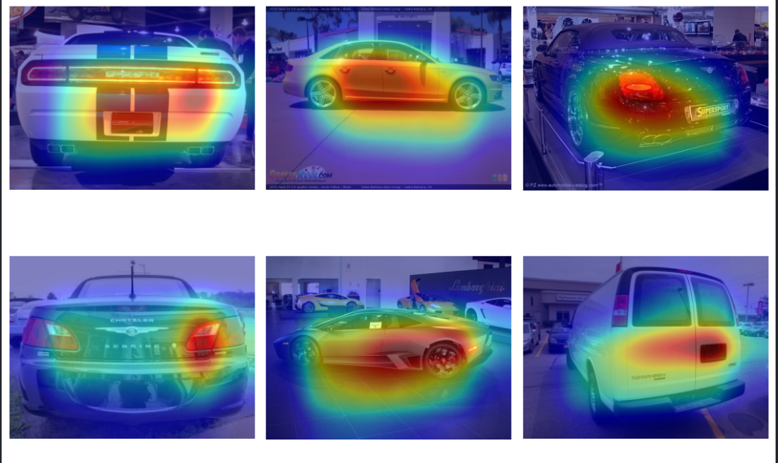

  <!-- You are encouraged to replace this logo with your own! Otherwise you can also remove it. -->
  
   

# PROJECT 6MILARITE

Bienvenue sur le repo du groupe 2 du challenge 6miliarité!

<!-- TABLE OF CONTENTS -->

# 📗 Table of Contents

- [📒 Journal De Bord](#jdb)
- [🛠 Dependencies](#dependencies)
- [💻 Usage](#usage)
- [📖 Dataset](#dataset)
- [👥 Authors](#authors)
- [Modalités d’évaluation](#modalités)

<!-- ## 📒 Journal de Bord: 
    [Notre Super Journal de Bord](/journal_de_bord) -->

## 🛠 Dependencies: 
    - pandas
    - matplotlib
    - scikit-learn
    - torchcam
    - seaborn
    - kaggle
    - torch

## 💻 Usage: 
    - clone the repo
    - python -m venv .venv
    - pip install -r requirements.txt

    Then you should be good to use the jupyter notebook!
    Note: If you don't want to use Kaggle to download the dataset
    You can do it manually and store it in a data folder 

## 📖 Dataset: 
    The Cars dataset contains 16,185 images of 196 classes of cars. The data is split into 8,144 training images and 8,041 testing images, where each class has been split roughly in a 50-50 split. Classes are typically at the level of Make, Model, Year, e.g. 2012 Tesla Model S or 2012 BMW M3 coupe.
    

Dataset Link: [DATASET](https://www.kaggle.com/datasets/jutrera/stanford-car-dataset-by-classes-folder/)

## 👥 Authors: 
    - Jonathan Bouniol
    - Eléonore De Bokay
    - Alexandre Devaux-Rivière
    - Maxime Buisson